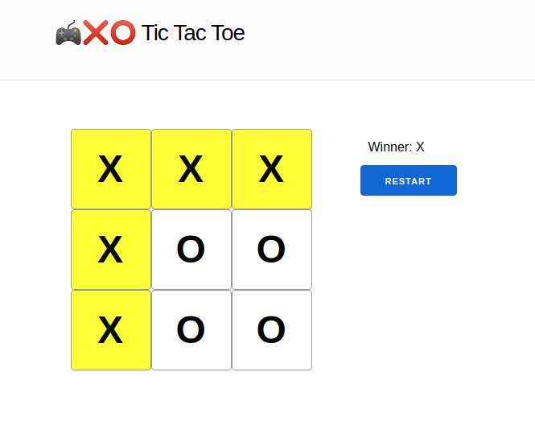

# TicTacToe

Server-side rendered port of [React's tic-tac-toe tutorial](https://reactjs.org/tutorial/tutorial.html) with Elixir/Phoenix/LiveView/Surface



## Why?

- A small project to write some [Elixir](https://elixir-lang.org/) as I learn
  - Elixir is a functional programming language that is good at building real-time things among other things :)
  - Phoenix is an Elixir web framework, and is positioned similar Rails to Ruby, Django to Python etc.
  - LiveView is a Phoenix component for server-side rendering webpages in a real-time manner.
- A good comparison with the typically client-side rendered React.js
  - How can we server-side render the same interactive game with little-to-none JavaScript?
- An escape from having to write templates in the Phoenix LiveView framework
  - Surface (https://github.com/msaraiva/surface) is a relatively new library for writing LiveView in a component-based manner, and makes the project conceptually closer to React.

Caveat: Didn't implement time travel since it's less important compared with the goal, but it's straight-forward to extend and add as well.

## Getting started

### First-time setup

```bash
# Install elixir if you haven't, with e.g.
brew install elixir   # for macOS

mix deps.get                      # Install Elixir dependencies
cd assets && npm install && cd .. # Install Node.js dependencies
```

### Run locally

```bash
mix phx.server
```

Now you can visit [`localhost:4000`](http://localhost:4000) from your browser.


## Useful resources 

### Phoenix

- [Official website](https://www.phoenixframework.org/)
- [Guides](https://hexdocs.pm/phoenix/overview.html)
- [Docs](https://hexdocs.pm/phoenix)

### LiveView

- [Search for docs in LiveView](https://hexdocs.pm/phoenix_live_view/search.html?q=foo)
- [Bindings in LiveView](https://hexdocs.pm/phoenix_live_view/bindings.html)

### Surface

- [Surface repo on GitHub](https://github.com/msaraiva/surface)
- [Surface docs: Components Basics](http://surface-demo.msaraiva.io/components_basics)
- [Surface docs: Properties](http://surface-demo.msaraiva.io/properties)
- [A realworld Surface app for referencing usages](https://github.com/razuf/elixir-phoenix-surface-realworld)
